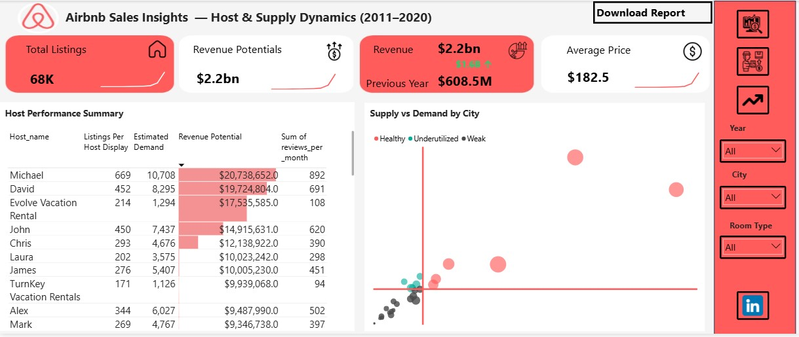

# Airbnb-Sales-Insights
Airbnb U.S. listings analysis (2011–2020) with Power BI. Includes data cleaning, star-schema modeling, 40+ DAX measures, and interactive dashboards revealing revenue potential, host dynamics, pricing signals, and demand trends.
🏡 Airbnb Sales Insights (2011–2020)

📑 Table of Contents  
1. Overview  
2. Rationale for the Project  
3. Objectives  
4. Data Description  
5. Tech Stack  
6. Project Scope  
7. Methodology  
8. Project Visualization  
9. Results (Key Findings)  
10. Recommendations (Prioritized)  
11. Future Work  
12. Conclusion  

---

1. Overview  
This repository contains an end-to-end analysis of U.S. Airbnb listings (2011–2020).  

Deliverables:  
- Reproducible data pipeline  
- Governed star schema for Power BI  
- Four interactive dashboards (Market Overview, Host Dynamics, Trends & Seasonality, Room Profiles)  
- Paste-ready DAX and Power Query artifacts  

The analysis surfaces where to invest, who to partner with, and how availability & seasonality can be monetized.  

---

2. Rationale for the Project  
Airbnb performance varies strongly by city, host type, room type, availability, and weekday/season. Decision makers need:  
- Defensible city-level revenue potential  
- Host concentration and commercial-host risk  
- Pricing signals by availability and weekday  
- Image-backed room profiles to improve conversion and merchandising  

This work turns listing-level data into operational playbooks for Growth, Pricing, and Partnerships.  

---

3. Objectives  
- Quantify revenue potential by city and room type  
- Expose host concentration and identify commercial partners  
- Build availability-aware pricing signals and surface seasonality (weekday/month)  
- Provide a reproducible, governed Power BI deliverable that non-technical stakeholders can use  

---

4. Data Description  
Primary files (cleaned, PII-redacted):  
- AirBnB_US_2020_real_dataset.xlsx — listing-level fact table (id, host_id, city, room_type, price, reviews_per_month, availability_365, last_review, etc.)  
- HostLookup.csv — host metadata + host_type (Commercial/Individual)  
- images/ or images.csv — unpivoted image table: listing_id, feature, ImageURL  

Important derived fields:  
- Review_Date (from last_review) — for time intelligence  
- Availability Bucket — computed (Always / Long / Medium / Short)  
- Estimated Demand — annualized reviews_per_month × 12 as a conservative booking proxy  
- Revenue Potential — price × estimated_bookings (assumptions documented)  

Quality controls: duplicate removal, outlier handling (winsorization where needed), null rules, and PII redaction.  

---

5. Tech Stack  
- Power BI Desktop — primary visualization & interactive report  
- Power Query (M) — canonical ETL (cleaning, image unpivot, Drive→uc conversion)  
- DAX — time intelligence, Pareto, cumulative %, availability buckets, ranking  
- Excel — intermediate checks and sample extracts  
- Imgur / Google Drive — image hosting strategy for Power BI compatibility  

Skills demonstrated: Power Query, advanced DAX (40+ measures), star-schema modeling, image pipeline engineering, data governance, product-first storytelling.  

---

6. Project Scope  
- Period: 2011–2020  
- Geography: U.S. cities present in dataset  
- Entity-level: listings (linked to hosts) — booking-level transactions not available  
- Assumptions: reviews_per_month used as demand proxy; nights-per-booking and other multipliers documented in docs/assumptions.md  

---

7. Methodology  
The project followed a structured, end-to-end data analytics workflow:  

1. Data Preparation & Modeling  
- Designed a robust data model (star schema) connecting fact listings, hosts, and calendar tables for time intelligence  
- Built custom classification logic such as Availability Buckets and Market Status  
- Implemented data governance: duplicate removal, null handling, and outlier control  

2. Advanced DAX Engineering  
- Created 40+ measures powering analysis: revenue potential, estimated demand, host concentration (Pareto), cumulative percentages, and utilization ratios  
- Designed scenario-based KPIs (e.g., Always vs Medium-term availability, Commercial vs Individual hosts)  
- Applied time intelligence (growth %, seasonality, weekday demand) for actionable trend detection  

3. Visual & UX Innovation  
- Developed multi-page dashboards tailored to stakeholder groups (Executives, Partnerships, Pricing, Product)  
- Engineered an image integration pipeline to create visual room profiles within Power BI  
- Applied conditional formatting, annotations, and drill-throughs  

4. Business Lens  
Every technical step was framed in terms of decision value:  
- Identifying profitable cities  
- Prioritizing host partnerships  
- Optimizing weekday pricing  
- Improving listing presentation  

---

8. Project Visualization  
Dashboards created:  
1. Market Overview (Executive): KPIs, Revenue % by Market Status, City ranking by Revenue Potential  
2. Host Dynamics (Partnerships): Pareto chart, Host performance table, Supply vs Demand scatter (quadrant analysis)  
3. Trends & Seasonality (Ops/Pricing): Monthly trends, Weekday demand (Thursday spike), Price by availability buckets  
4. Room Profiles (Product): 6-image gallery per room type, Avg Price, Reviews, Availability distribution  

---

9. Results (Key Findings)  

Market performance (top / bottom)  
- Top revenue cities:  
  - Hawaii — 6,157 listings, $336,602,684 revenue potential  
  - Los Angeles — 9,966 listings, $326,224,513  
  - New York City — 14,952 listings, $272,173,338  

- Low revenue (sample):  
  - Salem (52 listings, $723,103)  
  - Pacific Grove (47 listings, $1,610,813)  
  - Cambridge (326 listings, $6,598,558)  

Pricing & distribution  
- Avg price by room type: Hotel 259.9, Entire Home 224.5, Private Room 90, Shared 57.4  
- Distribution: Entire homes 33,384, Private rooms 14,344, Shared rooms 756, Hotel rooms 421  

Host performance (top examples)  
- Michael — 669 listings, demand 10,708, reviews/month 892, revenue potential 20,738,652  
- David — 452 listings, demand 8,295, revenue potential 19,724,804  
- Evolve Vacation Rental — 214 listings, revenue potential 17,535,585  

Top hosts are predominantly commercial — clear partnership targets.  

Availability-driven pricing (selected)  
- Always available: Entire Home 269.4, Hotel 147.2  
- Medium-term availability: Hotel 344.9, Entire Home 209.3  
- Availability bucket is a high-signal feature for pricing.  

Temporal & demand signals  
- Weekday demand (descending): Thursday 260,510, Monday 175,847, Tuesday 165,299, Friday 122,730  
- Monthly revenue peaks: Jan 233.9M, Jul 210.6M, Aug 204.4M  
- Revenue growth (YoY highlights):  
  - 2012 +1608.4%  
  - 2014 +513.4%  
  - 2019 +276.9%  
  - 2020 +281.5%

 
 

---

10. Recommendations (Prioritized)  
1. Strengthen Partnerships with Commercial Hosts  
   - Top hosts control a disproportionate share of listings and revenue (e.g., Michael with 669 listings, 20.7M potential).  
   - Establish structured partnerships with these hosts.  
   - Impact: Secures stable supply, reduces churn risk, sustains predictable revenue streams.  

2. Implement Availability-Aware Pricing Models  
   - Always-available homes price significantly higher (269.4) compared to medium-term homes (209.3).  
   - Introduce dynamic pricing models tied to availability.  
   - Impact: Optimizes price-to-demand alignment, increases yield per listing.  

3. Launch Targeted Mid-Week Demand Campaigns  
   - Demand peaks mid-week, particularly on Thursdays (260K+ demands).  
   - Design promotions and bundles focused on Thursday stays.  
   - Impact: Converts peak demand into bookings, improving occupancy & ADR.  

4. Enhance Listing Visuals and Content Standards  
   - Weak presentation drives underperformance.  
   - Scale visual standards (professional photos, feature highlights, availability clarity).  
   - Impact: Improves conversion, elevates host performance, strengthens Airbnb’s brand.  

5. Productionize and Automate the Data Pipeline  
   - Current analysis is static.  
   - Deploy automated pipelines with refresh scheduling, alerting, version control.  
   - Impact: Provides continuous intelligence, supports proactive decision-making, ensures scalability.  

---

11. Future Work  
- Price elasticity model (hierarchical / regularized regression) → optimal price changes per city × room type  
- Host churn & cohort analysis → retention plays  
- Propensity model → hosts likely to convert to commercial/always-available  
- Event enrichment → capture uplift near conferences/holidays  

Each should include experimental design and holdout tests.  

---

12. Conclusion  
This analysis provided a comprehensive view of Airbnb’s U.S. market (2011–2020).  

Uncovered insights:  
- Where to invest → Hawaii, Los Angeles, New York  
- Who to partner with → Commercial hosts controlling supply  
- How to optimize → Pricing strategies by availability & weekday demand  
- When to act → Seasonal and weekday patterns  

The recommendations are actionable: strengthen partnerships, refine pricing, launch targeted campaigns, improve host content quality.  

Beyond insights, this project demonstrates a repeatable analytics framework: clean data engineering, reproducible modeling, stakeholder-focused dashboards, and a predictive roadmap.  

In essence, this project transforms Airbnb data into a decision-support system for growth, efficiency, and revenue optimization.  

👨‍💻 Author: [Oyinlola Kayode]  
📌 Skills demonstrated: Power BI | DAX | Power Query | Data Governance | Business Storytelling  
